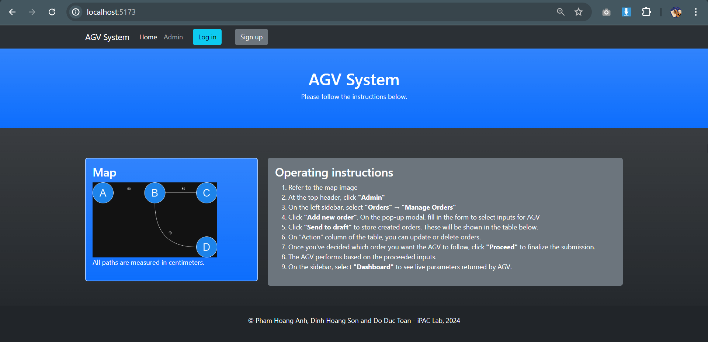

A. HƯỚNG DẪN KÉO CODE:

1. Cách kéo code từ GitHub về máy:

- Tạo 1 folder mới
- Mở terminal (command prompt) và cd tới folder đó, chạy: git clone https://github.com/sondhg/agv-project.git

2. Cài các thư viện:

- Mở 1 terminal, nhập lần lượt các lệnh: cd client --> npm i
- Mở 1 terminal nữa, nhập lần lượt các lệnh: cd json_server --> npm i
  Tải xong có thể đóng các terminal này

B. CÁCH CHẠY UI SAU KHI CLONE CODE VỀ:

1. Chạy giao diện web

- Mở 1 terminal bên trong folder tổng, rồi nhập "cd client" (chuyển tới folder client) rồi nhập "npm run dev"
  ===> Giao diện đã chạy, bấm vào link "localhost:5173" để xem GUI

2. Chạy server ẢO (Đây chỉ là server đơn giản để test API với JSON, chưa phải server của Hoàng Anh)

- Mở 1 terminal KHÁC vẫn từ folder tổng --> cd server --> npm start
  ===> json-server ở localhost:8000 (gồm nhiều nhánh: /orders-draft, /orders-proceeded, /login, /register, ...) đã chạy

  - Có thể vào file "db.json" ở folder "server" để xem, check các thay đổi và sửa đổi database ảo

- Server WebSocket tôi đang dùng test là server của Binance check giá bitcoin: wss://stream.binance.com:9443/ws/btcusdt@trade

3. Chạy server của Hoàng Anh
   Hiện tại chưa biết làm 😢

C. CÁCH THAO TÁC TRÊN UI

- Đọc ở trang Home, phần Operating Instruction

D. Note về API và WebSocket

- Các tác vụ API tôi để ở file: client/src/services/apiServices.jsx
- WebSocket: ở file client/src/components/Admin/Content/Dashboard/Dashboard.jsx, đây cũng là file dùng hiển thị bảng dữ liệu

E. Hình ảnh các trang của web:

- Home
  
- Login
  
- Register
  
- Admin (Dashboard)
  
- Manage Orders
  
  

F. Tài liệu học:

- Playlist học React:
  https://www.youtube.com/playlist?list=PLncHg6Kn2JT7QbvdNNAmQZLqWchnJEoH5

- Tài liệu PDF của khóa học: Check mục lục cho dễ tìm phần mình cần
  https://drive.google.com/drive/folders/1WYAyusS4m498bqCR8iyzRYmS26zGh8g-

(Khóa học này đã viết sẵn backend)
